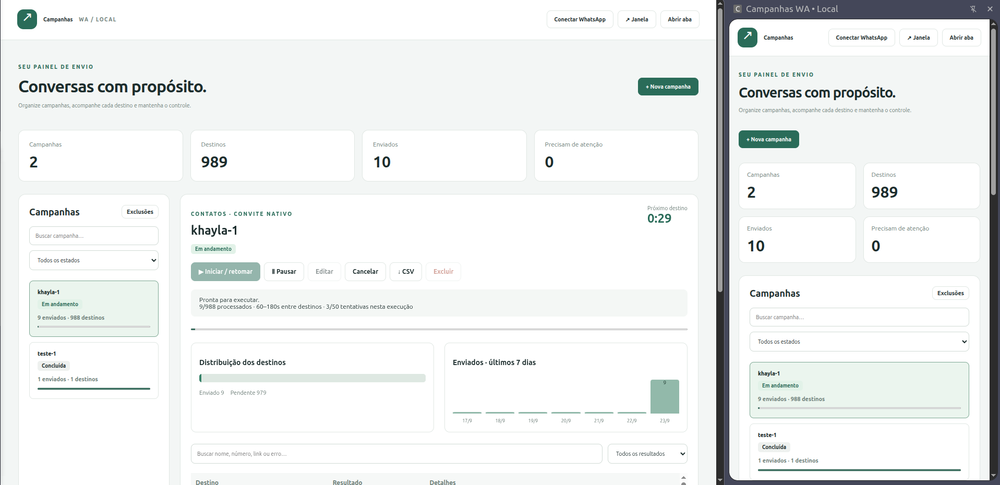

# Campanhas WA • Local — v1.2.0

[Documentação em português](README.md)



*Screenshot of version 1.0 in use, supplied by the user. The application interface remains in Portuguese; this document is its English guide.*

A local Chrome Manifest V3 extension for campaigns with authorized contacts and groups. It includes source code, tests, a bundled WA-JS build, and an installable `dist` directory. No backend, remote runtime dependencies, or build dependencies are required. Campaigns are stored in `chrome.storage.local`, with access restricted to trusted extension contexts.

### New in 1.2 — editor and CSV preview

Choose **Botão CTA**, **Quick reply** or **Lista** in the visible format buttons in **Nova campanha** (or Edit). CTA provides button text and URL/call action; quick replies provide button text and reply ID; lists provide opening-button text, sections, option IDs, titles and descriptions. Add/remove items, set title/footer and review the illustrative preview. Switching formats preserves drafts while the editor stays open.

Fill **Contato para teste** with an authorized phone including country code, then click **Criar teste de 1 contato**. This saves a separate stopped campaign; open it and click Start to send.

Importing a CSV shows a table with source record, name/ID, normalized destination, original value when changed and validation details. Search and filter valid, invalid or duplicate rows; choose 25/50/100 records per page. Filters only change the preview. Duplicate valid destinations are omitted from the queue; invalid entries remain recorded without sending. The version is visible in the top bar.

DOM tests cover the interactive fields, draft restoration, import filters, pagination and escaping. They do not replace a real WhatsApp delivery test.

## Features

- Import contact CSVs or group invite links, with validation and deduplication.
- Text messages and native group invitation cards.
- **Experimental CTA buttons:** 1–3 URL or phone-call buttons.
- **Experimental quick replies:** 1–3 reply buttons with unique IDs.
- **Experimental lists:** up to 10 options grouped into sections.
- Campaign creation, editing, start/resume, pause, cancellation with confirmation, and deletion with confirmation.
- Persistent per-recipient status, attempt history, message IDs and manual review of uncertain results.
- Configurable random intervals, daily attempt limit and per-run attempt limit.
- Dedicated campaign dashboard with metrics, charts, configuration, message content, remaining-wait estimate, error breakdown and recent activity.
- Search, filters, pagination and campaign result exports in CSV or XLSX.
- An **Extrair** dropdown for groups with invitation links, participants of selected groups, and contacts; all support CSV and XLSX.
- Side panel, standalone window and normal tab layouts, with narrow-screen table cards.
- A local exclusion list and explicit manual resumption after interruptions.

Interactive formats depend on WhatsApp Web's internal functionality. WA-JS documenting a method does not guarantee that buttons or lists will be rendered on the recipient's device. Use a one-contact test before a campaign. This version does not track button responses or list selections.

## Install without building

1. Extract the ZIP into a permanent directory, for example `~/Documents/campanhas-wa`.
2. Open `chrome://extensions/` in Chrome 120 or newer.
3. Enable **Developer mode**.
4. Click **Load unpacked** and select **`campanhas-wa/dist`**, the directory containing `manifest.json`.
5. Open `https://web.whatsapp.com/`, sign in and keep only one WhatsApp Web tab open when connecting.
6. Pin the extension through Chrome's extensions menu and click its icon to open the side panel.
7. Click **Conectar WhatsApp**. The extension injects its bundled WA-JS into the page's `MAIN` world using `chrome.scripting`. No console commands are needed.

Do not move or delete the installed directory. The side panel stays open when clicking the page. **Janela** opens a separate window; **Abrir aba** opens a normal tab. An always-on-top window depends on the operating system and is not implemented by this extension.

## Update from version 1.0 while preserving campaigns

1. Pause campaigns and wait for in-flight operations to finish.
2. Extract the new package to a temporary location.
3. Copy the new `campanhas-wa` contents over your existing project, keeping the **same installed `dist` path**.
4. In `chrome://extensions/`, click **Reload** on the existing extension. Do not click **Remove**.
5. Reload WhatsApp Web, then close and reopen the extension's panels.
6. Check existing campaigns and resume manually when ready.

Version 1.1 keeps the existing storage key and campaign format. New interactive configuration is optional; previous text/invitation campaigns remain compatible. Uninstalling the extension can delete its local data.

## Build and test

Requirements: Node.js 20+ and npm. Run `npm ci` to install the DOM testing dependency; building alone needs no dependencies.

```bash
cd ~/Documents/campanhas-wa
npm ci
npm test
npm run build
```

The build copies `src` and `vendor` into `dist` and prints the bundled WA-JS SHA-256. Load or reload `dist` in Chrome afterward.

## Create a campaign

1. Click **Nova campanha** and name it.
2. Choose **Contatos** (contacts) or **Links de grupos** (group links) before importing a CSV.
3. Import the file and review the valid, invalid and duplicate counts. Invalid rows remain visible but are never sent to.
4. Choose the message type:
   - **Mensagem de texto:** ordinary text.
   - **Convite nativo de grupo:** an invitation URL sent through `WPP.chat.sendGroupInviteMessage`, with optional caption. It does not silently fall back to a plain URL if the native invitation fails.
   - **CTA:** button text and URL or phone number with country code; optional title/footer.
   - **Quick reply:** button text and a unique reply ID; optional title/footer.
   - **Lista:** opening-button text, sections, option IDs, titles and descriptions; optional title/footer.
5. Write the message. `{{nome}}` substitutes the contact/group name; `{{numero}}` substitutes a contact's phone and is empty for group targets. These substitutions apply to the message/caption, not interactive option fields.
6. Set minimum/maximum interval, daily attempt limit and per-run attempt limit.
7. Click **Salvar campanha**. Saving never starts a campaign.
8. Review and click **Iniciar / retomar**. The first recipient also waits for a randomly selected interval.

**Criar teste de 1 contato** uses the authorized phone filled in **Contato para teste** and creates a separate, stopped one-recipient campaign using the current message configuration. Click Start on that campaign to actually send it. Verify the visual result on the receiving device.

Editing preserves destinations and history. It changes only the configuration for future sends. Create a new campaign to replace the recipient list or change its type.

## CSV formats

### Contacts

The supplied format is supported: `Nome;Numero;ID;Observacao`. `Numero` or `Telefone` is required; the importer also recognizes common English number/name headers. It supports UTF-8 BOM, comma/semicolon/tab separators, quoted fields, escaped quotes and embedded newlines.

Phone numbers must include country code. Formatting characters such as spaces, `+`, parentheses, dots and hyphens are stripped. Blank, nonnumeric or scientific-notation values are invalid. No country code is added automatically. `ID` is retained as a source reference, but delivery uses the phone number. A LID is never treated as a phone number.

### Groups

Use one `https://chat.whatsapp.com/CODE` link per line, **without a header**, as in the supplied group files. Header-based files with `Link`, `URL`, `Convite`, `Grupo` or `Link do grupo` are also accepted. Duplicates are removed by invite code, ignoring URL query parameters.

For group campaigns, the extension looks up the invite and joins only if the account is not already a member. If administrator approval is required, it records **Aguardando aprovação** and sends no message. Once approval is granted, manually review the row and return it to the queue. Admin-only posting, revoked invites and other failures appear per destination. Extraction features never join groups.

## Dashboard and controls

Select a campaign and click **Dashboard completo** for its dedicated route. It includes sent/pending/error/uncertain counts, total attempts, sent-to-total percentage, progress, daily chart, message preview, configured limits, interval-only wait estimate, grouped error reasons and recent events. The estimate excludes pauses, limits, request duration and browser delays. Use **Todas as campanhas** to return.

- **Pausar:** prevents future operations. An already-started send or join may finish.
- **Cancelar:** confirms and permanently cancels the campaign; it does not undo sends or group membership changes.
- **Editar:** available while stopped with no operation in flight.
- **Excluir:** confirms deletion of campaign and history. Daily counters are retained.
- **Revisar:** for errors, pending approval or uncertain sends. After checking WhatsApp, type `REPETIR` to queue again, `ENVIADO` to confirm manually, or `IGNORAR` to skip. Repeating an uncertain send can duplicate a message.
- **CSV / XLSX:** exports the entire campaign, regardless of active filters.
- **Exclusões:** one digits-only international phone number or exact group URL per line. Matching pending targets are skipped before preparation. Already-started operations may finish.

## Extract groups, participants and contacts

Open **Extrair** in the top bar:

1. **Grupos e convites:** choose groups, then query their current invitation links. All groups are initially selected. The extension does not create, rotate or revoke links. Permission failures leave the link blank with the reason in `Observacao`.
2. **Participantes de grupos:** select one or more groups. Search and select/clear visible results are available. Each row includes name, phone, ID, group name/ID and observations. A person belonging to multiple selected groups appears once per group to preserve provenance.
3. **Contatos:** defaults to saved address-book contacts. Uncheck the option to include other contacts available in the session cache. This cannot guarantee a complete copy of the phone's address book.

Click **Extrair**, monitor progress, select **CSV** or **Excel (.xlsx)** and click **Baixar resultado**. **Interromper** stops after the current query and leaves partial results available for download. Each query batch is time-limited. Download results before closing/reloading the panel or starting another extraction: extraction results are held in panel memory and are not automatically added to campaigns.

Phone-to-LID mappings are resolved only when available. Unavailable names or numbers remain blank with observations. Changing accounts during extraction rejects subsequent queries.

CSV is UTF-8 with BOM and a semicolon separator. XLSX is a real OOXML workbook with filters and a frozen header row. Cells are stored as text to preserve phone numbers and prevent formula execution from contact names. XLSX cells longer than 32,767 characters are truncated. Neither format requires external services.

## Persistence, limits and interruptions

- One active campaign at a time.
- Campaigns are bound to the WhatsApp account used when first started. A different account cannot resume that campaign.
- Local persistence is per Chrome profile; there is no cloud sync or full database backup/restore feature.
- Closing, discarding or reloading the linked WhatsApp tab pauses campaigns. Another tab is not selected automatically.
- Closing Chrome interrupts execution. Active campaigns are paused on the next browser session and require manual resumption.
- A periodic health check runs roughly every 30 seconds, plus a pre-destination check. A pending operation may take up to 60 seconds to time out.
- Unconfirmed/interrupted sends become **Incerto** and pause the campaign. There is no automatic retry and no exactly-once guarantee from WhatsApp Web.
- **Enviado** means ACK >= 1, or an explicit manual confirmation. It does not prove delivery, reading or rendering of interactive components.
- Interval range: **30 seconds to 24 hours**. Chrome may delay alarms. Delays exceeding two minutes cause a manual-resume pause; overdue sends are not executed in a burst.
- Daily attempts aggregate across all campaigns for that account in this Chrome profile, including deleted campaigns and attempts that fail during preparation. The counter uses the computer's local day. Each campaign applies its configured daily ceiling to that total. It is not an official WhatsApp quota.
- Per-run attempts reset on Start/resume; daily attempts do not.
- Routine service-worker restarts preserve scheduled campaigns. If an operation was in flight, recovery marks it uncertain and pauses the campaign.

Deleting the extension, clearing its storage or losing the Chrome profile may delete campaign data. Export results you need to retain.

## WA-JS updates

The package includes unmodified **WA-JS v4.6.0** from the official release. A pinned version makes failures reproducible. No remote code is downloaded while using the extension.

```bash
# Download a specific stable version
node scripts/update-wa.mjs v4.6.0
npm run build

# Or try the development nightly
node scripts/update-wa.mjs nightly
npm ci
npm test
npm run build
```

The updater needs GitHub access and may use unpkg for license files. If the corresponding licenses cannot be obtained, it preserves the current bundle and reports an error. Reload the extension and WhatsApp after updating. WhatsApp Web changes can break WA-JS functions independently of the extension.

## Validation and initial test

**31 automated tests pass**, covering CSV parsing/deduplication, validation, lifecycle recovery, intervals, limits, exclusions, pause during send, uncertainty, group approval/restrictions, native invitations, interactive dispatch, LID handling, account changes, export structure and dashboard escaping.

The original sample CSVs parsed as 988 contacts and two lists of 40 group links, with no internal duplicates. This validates formatting, not current phone/group availability. Those personal CSVs are not distributed in this package.

XLSX output was independently opened with openpyxl and checked for ZIP/XML integrity, Unicode, text phone preservation, formula safety, filters and frozen headers. Chrome and WA-JS integrations were tested with mocks. **No real messages, group joins or account logins were performed by the developer in this environment.** Automated browser/visual validation could not be completed because a working Chromium binary was unavailable and download attempts did not provide a valid archive. Responsive breakpoints were implemented but are not a claim of verified behavior on every device.

For your first real test, use one authorized contact, a batch limit of 1 and a 30–35 second interval. Verify text, invitation and interactive formats separately on the recipient's phone. Test pausing, closing the WhatsApp tab, restarting Chrome and reviewing an uncertain result before running a larger campaign. Test extraction using a small group selection and verify both file formats.

## Project layout

```text
src/manifest.json       MV3 configuration and permissions
src/background.js       Persistence, scheduling and execution
src/adapter.js          WA-JS message calls in the page context
src/core.js             CSV parsing, validation and recovery
src/index.html          Dashboard, dialogs and forms
src/ui.js               Main interface and routing
src/style.css           Responsive layouts
src/interactive-ui.js   CTA, quick reply and list editors
src/dashboard.js        Dedicated campaign dashboard
src/extractor.js        Read-only WA-JS extraction calls
src/extraction-ui.js    Group selection, progress and downloads
src/export.js           CSV and local XLSX writer
vendor/                 WA-JS and third-party licenses
scripts/                Build and bundle updater
tests/                  node:test suite
docs/painel.png          User-provided screenshot
dist/                   Ready-to-load extension
```

References: https://wppconnect.io/wa-js/ ; https://github.com/wppconnect-team/wa-js ; https://developer.chrome.com/docs/extensions/reference/api/scripting ; https://developer.chrome.com/docs/extensions/reference/api/alarms ; https://developer.chrome.com/docs/extensions/reference/api/sidePanel . Third-party licenses are retained in `vendor` and `dist/vendor`.
